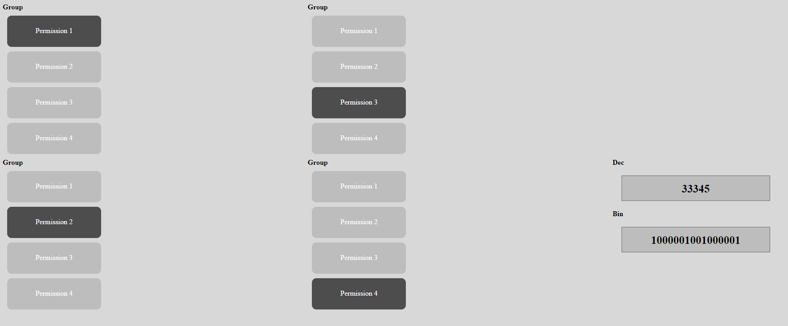

# Permissions generator

#### This is a html ui to generate the decimal/binary values similar to unix permissions  that you could use for granularity of application permissions



To add more modules (permissions) just put following divs in the next empty group (div5, div6 and so on)

```
<span>Group</span>
<div class="permission_block" id="module_X">Module X</div>
<div class="permission_block" id="module_Z">Module Z</div>
<div class="permission_block" id="module_Y">Module Y</div>
<div class="permission_block" id="module_W">Module W</div>
```
#### Counter length should update automatically


# Python

### Example usage of permissions written in decimal 

```python
    compute_permissions(decimal_value=33345)
    [<Module4 permission: DELETE>, <Module3 permission: READ>, <Module2 permission: UPDATE>, <Module1 permission: CREATE>]

```

```python
    Permission.CREATE in [x for x in compute_permissions(decimal_value=33345) if type(x) == Module1]
    True
```

```python
    Permission.CREATE in [x for x in compute_permissions(decimal_value=33345) if type(x) == Module2]
    False
```


